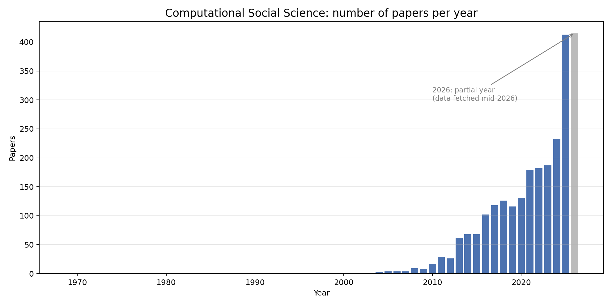
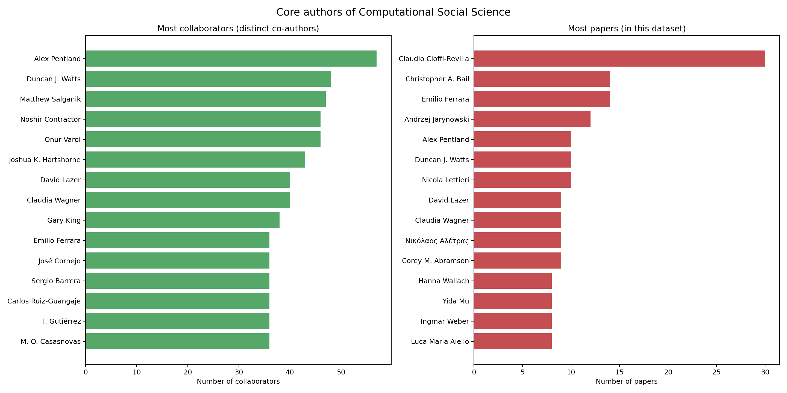
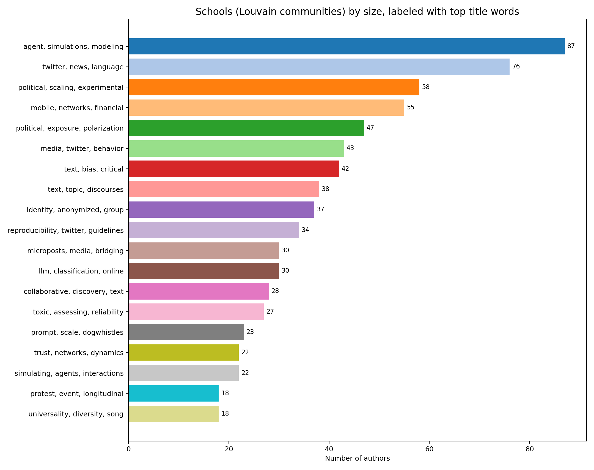
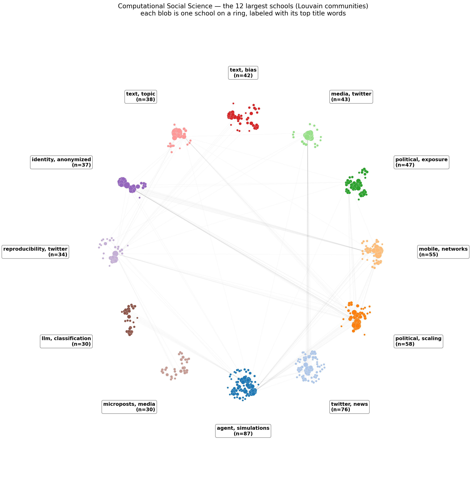

# 计算社会科学领域的合作网络分析


> 用 [OpenAlex](https://openalex.org) 的公开学术数据,把「计算社会科学(Computational Social Science, CSS)」这个领域**本身**当成研究对象:它的核心作者是谁、分成哪几个学派、彼此如何连接。

这是一个面向初学者的入门数据项目,用 Python 完成从「抓数据 → 建网络 → 找社群 → 可视化」的完整流程,代码均有中文注释。



*这个领域在 2005 年前几乎空白,2015 年后爆发式增长——直观回答了"它是怎么发展起来的"。更多图见下方「四张图读懂这个领域」。*

---

## 主要发现

数据为标题或摘要中含确切短语 “computational social science” 的论文,共 **2523 篇**。由此构建的作者合著网络:

| 指标 | 数值 | 含义 |
|---|---|---|
| 作者(节点) | **4564** | 出现过的不同作者人数 |
| 合作(边) | **10740** | 有过合著关系的作者对数 |
| 平均合作者数 | **4.71** | 每位作者平均与多少人合作过 |
| 连通块 | **1392** | 互相连得上的人群数量(领域仍较分散) |
| 最大「巨核」 | **742 人(16.3%)** | 最大的连通核心圈 |

**合作最广 / 发文最多的作者**,基本就是这一领域的代表人物:Alex Pentland、Duncan J. Watts、Matthew Salganik、David Lazer、Emilio Ferrara、Gary King、Christopher A. Bail、Claudio Cioffi‑Revilla 等。

在巨核里用 Louvain 社群发现算法,划出约 **20 个社群**,几个较大的可清晰对应到真实的子流派(社群内核心作者 + 论文标题高频词):

- **网络科学 / 行为实验核心圈** —— Watts、Salganik、Lazer、Vespignani(主题:experimental、behavioral、scaling)
- **基于主体的建模 / 复杂系统** —— Kertész、Cioffi‑Revilla、Conte(主题:agent、simulation、modeling)
- **社交媒体 / 机器人 / 虚假信息** —— Ferrara、Menczer、Varol、Cresci(主题:twitter、bots、election)
- **政治极化 / 媒体效应** —— Christopher Bail、Volfovsky、Freelon(主题:polarization、exposure、opposing views)
- **人类移动 / 手机大数据 · 数据向善** —— Pentland、Nuria Oliver、Letouzé(主题:mobile、human mobility）
- **计算文本分析 / text-as-data** —— Gary King、Grimmer、Wallach、Niekler(主题:text、topic、language）

> 「主题高频词」是从社群成员论文标题里自动提取的,作为研究方向的**代理指标**,并非严格的关键词标注。

## 四张图读懂这个领域

**核心作者**(左:合作者最多;右:发文最多)



**各学派规模与代表主题**(在最大连通块上用 Louvain 划分,标签为标题高频词)



**12 大学派全景**(各学派排成一圈、互不重叠;框内是主题词和人数,中间淡线是学派之间的合作)



---

## 项目结构

```
opencode-css/
├── check_env.py          # 环境自检:导入各库并打印版本
├── fetch_openalex.py     # 阶段二:从 OpenAlex 抓取论文元数据
├── build_network.py      # 阶段三:构建合著网络 + 基础指标
├── find_communities.py   # 阶段四:Louvain 社群发现 + 可视化
├── requirements.txt      # 依赖清单
├── figures/              # 输出的图片(纳入版本库)
└── data/                 # 抓取的数据与中间网络文件(.gitignore 忽略,可由脚本重建)
```

---

## 如何复现

需要 Python 3.9+(本项目在 Windows + Python 3.9 上开发)。

```powershell
# 1) 建并激活虚拟环境(Windows PowerShell)
py -m venv .venv
.\.venv\Scripts\Activate.ps1

# 2) 安装依赖
pip install -r requirements.txt

# 3) 按顺序运行四个脚本
python check_env.py            # 确认环境 OK
python fetch_openalex.py       # 抓数据 -> data/works.jsonl(约 2500 篇,十几秒)
python build_network.py        # 建网络 + 打印指标 -> data/coauthor_network.graphml
python find_communities.py     # 找社群 + 出 4 张图 -> figures/*.png
```

> macOS / Linux 下,激活命令改为 `source .venv/bin/activate`,其余相同。
> 想换一个研究领域?修改 `fetch_openalex.py` 顶部的 `SEARCH_PHRASE` 即可。

---

## 方法说明与局限

- **领域界定**:用「标题/摘要含确切短语 computational social science」来圈定,而非更宽的全文搜索(约 96 万篇)或单一主题标签(约 7 万篇)。这样得到的论文最贴合"自我认同为该领域"的集合,但也会漏掉用词不同的相关工作。
- **合著网络**:作者为节点,合写论文即连边,边权为合写次数。**作者数超过 50 的论文只计作者、不连边**,以免少数"超大合作"论文制造出失真的全连接团。
- **作者消歧**:直接采用 OpenAlex 的作者实体 id,免去手工对同名作者去重,但完全依赖其消歧质量。
- **社群发现**:用内置于 networkx 的 **Louvain** 算法(无需额外依赖);仅在最大连通块上运行,因为碎块上分社群没有意义。结果随机种子固定(SEED=42)以保证可复现。

---

## 后续可做(进阶)

- **文本主题演化**:对论文摘要做主题模型 / embedding,观察该领域研究前沿如何随年份迁移。
- **统计推断**:切出某一年的网络,用 ERGM(R 的 `ergm` / `RSiena`)检验"同机构是否更易合作"等假设。

---

## 数据来源与致谢

学术元数据来自 **OpenAlex**(https://openalex.org),其数据以 CC0 释出。感谢 OpenAlex 提供免费、开放的接口。

本项目为学习用途,代码以 **MIT License** 开源(见 [LICENSE](LICENSE))。
